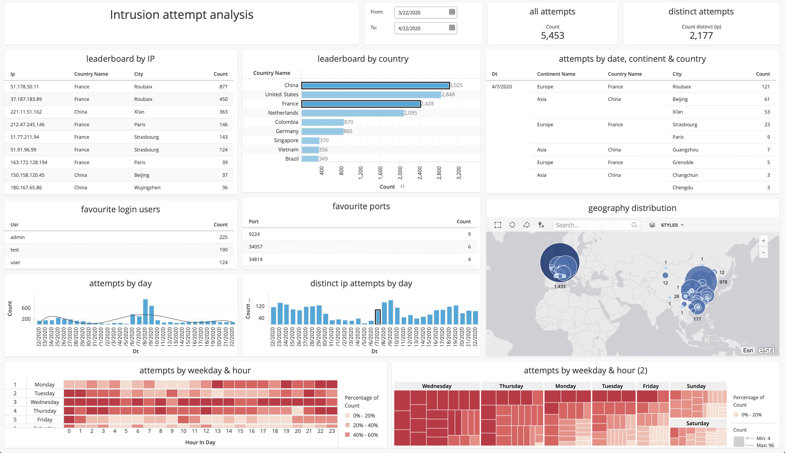

# Intrusion attempts analysis (IAA)
A pilot project can be used as the starting point for establishing an intrusion monitoring system or quick solution to find additional information about the logistics and characteristics of scanning attacks by analysing authentication and authorization system logs on a remote server (rsyslog). Implementation is currently focused on extracting and visualizing information from security logs /var/log/secure*. 

Project was created as part of tretton37's data demo days to show the possibilities of fast prototyping and flexible analysis with data integration and BI tools. Current implementation is meant to be used in a single run mode without incremental loading capabilities and any special error handling. Visualization was tested on a small dataset in a local Postgresql instance (16k rows, 12MB). 


## Overview
- Collect log files from remote server
    - Collect authentication attempts from remote server messages in  /var/log/secure*
- Filter & extract 
    - Filter rows containing ’Invalid user’
    - Extract user, ip, port & timestamp
- Enrich with GEO data 
    - Enrich each ip with geo data from ipstack.com
- Clean & prepare data (SQL query in Microstrategy)
    - Date, first attempt, attempt_no, etc..
- Visualize
    - IP & country leaderboard
    - Geographic visualization with time lapse
    - Attempts heatmaps & other

## Requirements
* Java 1.8
* Talend Open Studio 7.3
* Microstrategy Desktop (free edition)
* Postgresql 12.2 (container)
* Centos - remote access to the server using password or public key authentication (default)

(optional) Jdbc client of choice like pgAdmin, Datagrip, etc \
(optional) Ipstack account for retrieving geospatial data
  
## Usage
* Run a Postgresql instance and set db password:
```
docker run -d --name postgres -e POSTGRES_PASSWORD=postgres -e PGDATA=/var/lib/postgresql/data/pgdata -v /HOST_PATH_PGSQL:/var/lib/postgresql/data -p 127.0.0.1:5432:5432 postgres:12.2
```

* Import jobs from intrusions-talend.zip into Talend Open Studio
* Configure jobs parameters based on your environment:
 
| **Job name**  | **Job context parameter** | **Example**
| ---- | ------ | ------ |
| job_st_intrusion_attempt  | remote_host  | 113.103.82.119
| job_st_intrusion_attempt  | private_key| /Users/demo/id_rsa
| job_st_intrusion_attempt  | tmp_path  | /Applications/TOSDI-7.3.1/studio/workspace/tmp
| job_st_iplocation  | ipstack_token  | fc6391c71013f4c8617654696d21an6d

* Run jobs
    * job_st_intrusion_attempt
    * job_st_iplocation
* Open dashdboard
    * intrusions-demo.mstr
    
Database objects are automatically created during job execution. Talend and Miscrostrategy assumes connection to locahost (127.0.0.1:5432). When using a remote database connection properties should be changed accordingly.
